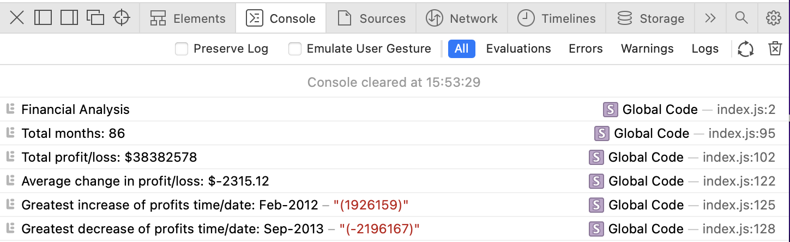

# Console-Finances

## **What?**
This exercise used newly acquired skills in Javascript to analyse a dataset containing financial records.

The task was to write code to analyse the dataset and meet the following criteria:

    - The total number of months included in the dataset.
    - The net total amount of Profit/Losses over the entire period.
    - The average of the changes in Profit/Losses over the entire period.
        - You will need to track what the total change in profits is from month to month and then find the average.
        - (Total/Number of months)
    - The greatest increase in profits (date and amount) over the entire period.
    - The greatest decrease in losses (date and amount) over the entire period.

## **How?**
The code I employed to provide the dataset analysis is displayed in the console using console.log.

When the file is opened in the browser, the final result looks as follows within the console log:

//Insert image//

## **Final result**

This is the link to the live application: https://nikki1162.github.io/Console-Finances/

This is the link to the GitHub repository: https://github.com/Nikki1162/Console-Finances
